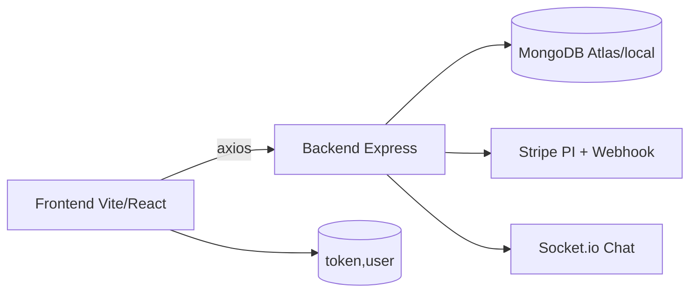
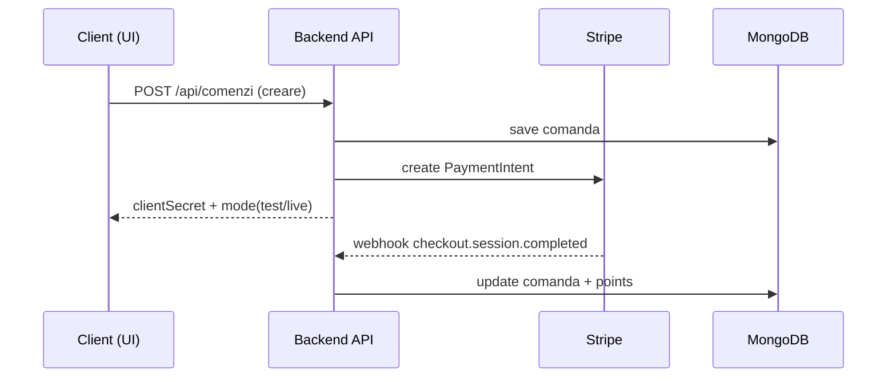

# Maison-Douce (Tort-app)

Scurt ghid de setup, testare și deploy pentru proiectul "Maison-Douce" (frontend + backend).

## 1. Cerințe locale
- Node.js >= 18
- npm
- MongoDB local (sau MongoDB Atlas URI)
- (opțional) Stripe CLI pentru test webhook

## 2. Structură proiect
- `/backend` - API Node.js + Express + Mongoose
- `/frontend` - React (Vite)

## Rezumat tehnic (scurt)

### Arhitectura (text diagram)
```
Frontend (Vite/React) --axios--> Backend API (Express)
    |                                   |
    |                                   +--> MongoDB (Mongoose)
    |                                   +--> Stripe (payment intent + webhook)
    |                                   +--> Socket.io (chat)
    |
    +--> Browser localStorage (token, user)
```

### Fluxuri cheie
- Calendar: sloturi (`CalendarSlotEntry`), rezervare (`/api/calendar/reserve`), list admin combinat comenzi+rezervari.
- Comenzi: create simple sau cu slot, export CSV, status/cancel, protejate cu auth.
- Fidelizare: portofel puncte/vouchere, aplicare la checkout (`/api/fidelizare/apply-*`).
- Plati: Stripe PaymentIntent + webhook (marcheaza comanda si adauga puncte).
- Chat: socket.io + persistare MesajChat.

### Modele esentiale (Mongo)
- `Utilizator { email, rol, parolaHash, pointsBalance, pointsHistory }`
- `Comanda { clientId, prestatorId, items[], subtotal, taxaLivrare, total, metodaLivrare, data/ora, status, paymentStatus, customDetails }`
- `Rezervare { clientId, prestatorId, comandaId, date, timeSlot, handoffMethod, deliveryFee, status, paymentStatus }`
- `CalendarSlotEntry { prestatorId, date, time, capacity, used }`
- `Fidelizare { utilizatorId, puncteCurent, puncteTotal, reduceriDisponibile[], istoric[] }`
- `MesajChat { text, utilizator, room, authorId, data }`

### Checklist deploy (scurt)
- Backend host cu env: `MONGODB_URI`, `JWT_SECRET`, `STRIPE_SECRET_KEY`, `STRIPE_WEBHOOK_SECRET`, `BASE_CLIENT_URL`.
- Frontend host cu `VITE_API_URL` spre backend.
- MongoDB Atlas index pe `CalendarSlotEntry {prestatorId,date,time}`.
- CORS permite origin frontend.
- Stripe: endpoint webhook in dashboard catre `/api/stripe/webhook` (live keys).
- SSL/HTTPS pe ambele servicii.

## 3. Config env

Creează un `.env` în `backend` pe baza fișierului `.env.example` și completează:
- `PORT` - port backend (ex. 5000)
- `MONGODB_URI` - conexiune MongoDB
- `STRIPE_SECRET_KEY` - Stripe secret (test) — NU comita în repo
- `BASE_CLIENT_URL` - URL frontend local (ex. http://localhost:5173)

Frontend: creează `frontend/.env.local` cu:
- `VITE_API_URL=http://localhost:5000/api`
- `VITE_PRESTATOR_ID=default`
- `VITE_STRIPE_PUBLISHABLE=` (opțional pentru integrare)

## 4. Pornire local

Backend (PowerShell):

```powershell
cd backend
npm install
node index.js
# sau cu nodemon
npx nodemon index.js
```

Frontend:

```powershell
cd frontend
npm install
npm run dev
```

## 5. Test Stripe webhook local (pasi)
1. Instalează Stripe CLI: https://stripe.com/docs/stripe-cli
2. Autentificare: `stripe login`
3. În terminal: `stripe listen --forward-to localhost:5000/api/stripe/webhook`
4. Declanșare test event: `stripe trigger checkout.session.completed`
5. Verifică logs-uri în backend console (cautează `[stripe webhook]`)
6. **Important:** Webhook-ul acum are logging complet și error handling

---

## 6. Recente implementări (A-E)

### A) ✅ Fix CANCEL pentru CalendarSlotEntry
**Problemă:** Funcția de anulare a comenzii descrementa doar legacy `CalendarPrestator.slots`, nu și `CalendarSlotEntry`.

**Soluție:** 
- Actualizat `PATCH /api/comenzi/:id/cancel` în `backend/routes/comenzi.js`
- Acum încearcă să decrementez `CalendarSlotEntry.used` în prioritate
- Fallback la legacy dacă slot-ul nu există
- Rollback logic preserved pentru consistency

**Fișiere modificate:**
- `backend/routes/comenzi.js` — cancel handler refactored

---

### B) ✅ Stripe Webhook Hardening + Test Guide
**Îmbunătățiri:**
1. **Better logging:** Messages cu `[stripe webhook]` tag pentru debugging
2. **Config validation:** Verifică dacă au STRIPE_SECRET_KEY și STRIPE_WEBHOOK_SECRET
3. **Error responses:** Return 500 cu stack trace pentru development
4. **Payment Intent logging:** Support for multiple event types
5. **Debug route:** `GET /api/stripe/webhook-test` shows config status

**Fișiere modificate:**
- `backend/routes/stripeWebhook.js` — Enhanced with comprehensive logging
- `backend/routes/stripe.js` — Added `/webhook-test` debug endpoint

**Test local:**
```powershell
# Terminal 1 — Backend
cd backend
npm start

# Terminal 2 — Stripe CLI
stripe listen --forward-to localhost:5000/api/stripe/webhook

# Terminal 3 — Trigger test
stripe trigger checkout.session.completed
```

---

### C) Cypress E2E + Seed User for Auth
**Adaugari:**
1. **Seed endpoint:** `POST /api/auth/seed-test-user` - creeaza/obtine test user si token (doar dev/test). Accepta `rol` (default `admin`) pentru rute admin.
2. **Cypress helpers:** `cy.loginAsTestUser()`, `cy.seedTestUser()`, `cy.loginWithToken()`.
3. **E2E tests:**
   - `booking-flow.spec.js` - full booking flow
   - `constructor-save-edit.spec.js` - 2D constructor save/edit
   - `personalizare.spec.js`, `reserve-api.spec.js`, `recommendations-ui.spec.js`
4. **Electron launch flags:** `frontend/cypress.config.js` adauga flag-uri pentru evitarea ferestrei albe in Cypress.

**Fisiere noi:**
- `frontend/cypress/support/auth.js` - Cypress auth commands
- `frontend/cypress/support/e2e.js` - Cypress config
- `frontend/cypress/e2e/booking-flow.spec.js` - Booking E2E test
- `frontend/cypress/e2e/constructor-save-edit.spec.js` - Constructor E2E test

**Fisiere modificate:**
- `frontend/cypress.config.js` - Electron launch flags (blank window fix)

**Rulare:**
```powershell
cd frontend
npm run cypress:open
# daca fereastra Cypress e alba (Electron), incearca:
npx cypress open --browser chrome
# headless:
npm run cypress:run
```

---

### D) ✅ Full Migration CalendarSlotEntry
**Obiectiv:** Elimina dependența de legacy `CalendarPrestator.slots` și folosiți `CalendarSlotEntry` exclusiv.

**Implementări:**
1. **Migration script:** `backend/scripts/migrate-calendars.js`
   - Citeste `CalendarPrestator.slots` și creează `CalendarSlotEntry` docs
   - Rulează cu: `node backend/scripts/migrate-calendars.js`
   
2. **Refactored routes:**
   - `GET /api/calendar/availability` — Query exclusiv `CalendarSlotEntry`
   - `POST /api/calendar/availability` — Upsert doar `CalendarSlotEntry` docs (no legacy sync)
   - `POST /api/calendar/reserve` — Increment atomic pe `CalendarSlotEntry` only
   - Rollback logic uses only `CalendarSlotEntry`

3. **Updated controllers:**
   - `backend/controllers/rezervariController.js` — booking/unbooking uses `CalendarSlotEntry`
   - `backend/routes/comenzi.js` — create-with-slot uses `CalendarSlotEntry` in transaction

**Fișiere noi:**
- `backend/scripts/migrate-calendars.js` — Migration script

**Fișiere modificate:**
- `backend/routes/calendar.js` — Refactored to use CalendarSlotEntry exclusively
- `backend/controllers/rezervariController.js` — Uses CalendarSlotEntry
- `backend/routes/comenzi.js` — Uses CalendarSlotEntry

**Rulare migrație:**
```powershell
cd backend
node scripts/migrate-calendars.js
```

---

### E) ✅ UI Polish Site-Wide (Tailwind)
**Creări:**
1. **Component library:** `frontend/src/lib/tailwindComponents.js`
   - Reusable Tailwind classes: `buttons`, `cards`, `inputs`, `containers`, `typography`, `grids`, `badges`
   - Consistency across app

2. **Pages styled:**
   - `CalendarClient.jsx` — Full redesign: gradient background, improved form layout, better typography, responsive
   - `AdminCalendar.jsx` — 2-column layout with card design, color-coded slots, styled reservations list

**Stil aplicat:**
- Gradient backgrounds (pink-to-purple theme)
- Improved form inputs și labels
- Better button styling with icons
- Responsive grid layouts
- Status badges (success/warning/error/info)
- Better typography hierarchy
- Hover states și transitions
- Mobile-first design

**Fișiere noi:**
- `frontend/src/lib/tailwindComponents.js` — Tailwind component library

**Fișiere modificate:**
- `frontend/src/pages/CalendarClient.jsx` — Full Tailwind redesign
- `frontend/src/pages/AdminCalendar.jsx` — Full Tailwind redesign

---

### F) Recomandări AI + UI + test Cypress
- Endpoint hibrid `/api/recommendations/ai` (GET/POST) combină popularitate globală, istoricul userului, preferințe (categorie), ingrediente de evitat și returnează motive transparente.
- UI nouă pe `Home` cu secțiunea „Recomandate pentru tine” (folosește endpoint-ul AI).
- Test E2E `cypress/e2e/recommendations-ui.spec.js` (interceptează API-ul și verifică secțiunea UI).

**Fișiere modificate/noi:**
- `backend/routes/recommendations.js`
- `frontend/src/api/products.js`
- `frontend/src/pages/Home.jsx`
- `frontend/cypress.config.js`, `frontend/cypress/e2e/recommendations-ui.spec.js`

### G) Curățare UI Coș + formular comandă client
- Coș și `ComandaClient` rescrise cu `tailwindComponents` (cards, buttons, inputs) pentru layout unificat.

**Fișiere modificate:**
- `frontend/src/pages/Cart.jsx`
- `frontend/src/pages/ComandaClient.jsx`

### H) Stripe config + rotație chei
- Endpoint `GET /api/stripe/config` expune `mode` (test/live) și status webhook/publishable pentru sanity check și rotație.
- `payment-intent` și `checkout-session` întorc `mode` pentru debugging.

**Fișiere modificate:**
- `backend/routes/stripe.js`

---

## 7. Urmatoarele steps (Opțional)
1. **Extend Cypress tests:** Add authenticated booking flow test cu UI interaction
2. **More UI polish:** Apply `tailwindComponents` la mai multe pagini (cart, checkout, profile)
3. **Unit tests:** Backend controller tests cu Jest
4. **Performance:** Add image optimization, code splitting
5. **Deployment:** Setup Vercel (frontend) + Render/Heroku (backend) + MongoDB Atlas

---

## 8. Troubleshooting

### Stripe webhook not working
- ✓ Check `backend/.env` has `STRIPE_SECRET_KEY` și `STRIPE_WEBHOOK_SECRET`
- ✓ Run `GET /api/stripe/webhook-test` to verify config
- ✓ Ensure `stripe listen` is running and forwards correctly
- ✓ Check backend logs for `[stripe webhook]` messages

### CalendarSlotEntry not found errors
- Run migration script: `node backend/scripts/migrate-calendars.js`
- Verify CalendarSlotEntry model is imported in routes
- Check index on `{prestatorId, date, time}`

### Comanda duplicate key (numeroComanda)
- Error: `E11000 duplicate key error ... numeroComanda: null`
- Fix: asigura-te ca backend-ul genereaza automat `numeroComanda` si reporneste serverul.

### Cypress tests failing
- Ensure backend is running on `http://localhost:5000`
- Check `POST /api/auth/seed-test-user` endpoint exists
- Verify MongoDB is connected
- Run `npm run cypress:open` for debugging
- If Cypress opens a blank window, try `npx cypress open --browser chrome`.

---

## 9. Diagrame rapide (mermaid)





---

**Version:** 1.5.0 (Dec 16, 2025)
**Last updated:** Cypress E2E fixes + admin seed role + numeroComanda auto-gen + README cleanup

